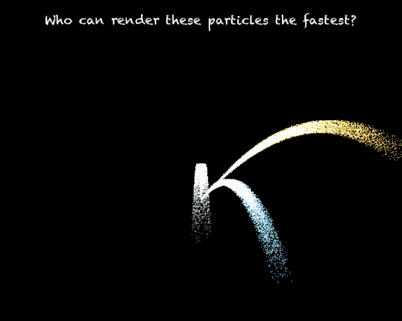

# DOD Particle Lab — Zig

A **visual particle simulator** — a fountain of 65,000 particles in three
streams (gray **smoke** rising, orange **sparks** arcing, blue **debris**
scattering) — rendered live with [raylib] in Zig on Apple Silicon:



It runs at a steady 60 fps in play mode, but the interesting number is how
*cheaply* each frame can be computed. That question — what does a frame of
65,000 particles *cost*, and how low can that cost go — is what this lab is
about. It's a hands-on laboratory for *feeling* the cache/perf lessons from
Mike Acton's CppCon 2014 talk, ["Data-Oriented Design and C++"][acton].

The thesis under test: a particle simulator is not one job, it's a handful of
loops over the same particles — integrate physics, decide which died, respawn
the dead, rasterize the survivors. Each loop touches a different subset of a
particle's fields. Lay out memory for the loops (the hot fields contiguous,
the cold ones out of the way) instead of for the object (one fat `Particle`
struct), and the loops get dramatically faster — *if* you're paying for the
bytes you actually stream. The number of particles N decides whether that
matters at all: at small N everything fits in cache and layout is noise; at
large N the sim is bandwidth-bound and layout *is* the ceiling.

This lab explores that transformation across several **memory layout
strategies** — each a different answer to how the particle data is arranged in
RAM. The physics (the math, the seed, the death model) never changes between
them; only the data layout and access pattern do. Each layout is explored by
sweeping its **cells** (strategy variants) across particle counts N, death
rates q, and thread counts, collecting per-trial timing into a run directory,
then analyzing the aggregated data to find the **champion cell per regime**
(no global winner — every champion carries regime + numbers + blueprint).

The first layout is [L1 — AoS full-field](src/layouts/L1_aos_full/README.md):
the strawman, one fat `Particle` struct per particle, every field the OOP
object would carry. Later layouts cut the dead fields, split hot from cold,
move to structure-of-arrays — each isolating one axis of the transformation.

### Layouts

A layout is one frozen data model (topology × field set × allocation policy —
zero comptime knobs; alignment/padding/field-set/topology changes are new
layouts, not flags). Each is explored by sweeping its cells across the
regime grid (below). Ordered by expected information-per-hour:

| #  | folder        | data model                                     | hot B/p | status       | priority reason                                             |
|----|---------------|------------------------------------------------|--------:|:------------:|-------------------------------------------------------------|
| L1 | `L1_aos_full` | AoS, full 11-field, plain alloc                |     ~68 | ✅ complete  | the strawman; re-label existing work, land the framework    |
| L2 | `L2_aos_lean` | AoS, lean 4-field, plain alloc                 |      29 | queued       | isolates field-set with topology fixed                      |
| L3 | `L3_hotcold`  | hot/cold AoS split                             | ~36 hot | queued       | arc stage 2's first structural win                          |
| L4 | `L4_tuple3`   | `[]Vec3` pos/vel + age + kind                  |      29 | queued       | the `ld3` deinterleave experiment; interesting Halide input |
| L5 | `L5_tuple4`   | `[]Vec4` pos/vel (aligned) + age + kind        |      37 | queued       | per-particle `@Vector(4)`, zero shuffles                    |
| L6 | `L6_soa`      | per-component `[]f32` (lean), plain alloc      |      29 | queued       | arc home turf; richest strategy soil                        |
| L7 | `L7_soa_al`   | per-component `[]f32`, 128 B-aligned, W-padded |      29 | queued       | isolates alignment+padding                                  |
| L8 | `L8_aosoa`    | blocked AoSoA                                  |  ~29–32 | queued       | the one genuinely untried topology                          |

**Cross-layout prediction** (hypothesis to test per vertical): Halide ties
Zig on SoA (L6/L7) and loses on AoS-family (L1/L2/L3) — the gather tax and
the inexpressible component-lane vectorization are the mechanism; B5/B6
render fusion wins on lean layouts at cache-resident N and loses on fat
layouts at DRAM.

[acton]: https://www.youtube.com/watch?v=rX0ItVEVjHc
[raylib]: https://github.com/raysan5/raylib

## Prerequisites

| tool     | why                                                 | version    |
|----------|-----------------------------------------------------|------------|
| [Zig]    | the build + the sim                                 | 0.16.0     |
| [raylib] | the play-mode renderer (git submodule, built)       | (pinned)   |
| [uv]     | python env management (Halide generator + analysis) | any        |
| [ffmpeg] | `--record` video export (raw RGBA pipe)             | any        |
| Xcode    | optional: PMC cycle-attribution (`pmc_*.sh`)        | macOS only |

[Zig]: https://ziglang.org
[raylib]: https://github.com/raysan5/raylib
[uv]: https://docs.astral.sh/uv/
[ffmpeg]: https://ffmpeg.org

## Setup

```sh
git clone --recurse-submodules <this-repo>
cd dod-particle-lab-zig

# Python env (one command — creates .venv, installs deps, writes uv.lock):
uv sync                      # analysis env: pandas + matplotlib + jupyterlab
uv sync --extra halide       # also installs halide (needed to build the halide cells)
```

The Python env serves two roles: the **analysis notebook** (`pandas` +
`matplotlib` + `jupyterlab`) and the **Halide pipeline generator** (build-time,
for halide cells only). `uv sync` gives you the analysis env; add `--extra
halide` if you'll build the two halide cells. The three Zig-only cells build
and collect without any Python env at all.

## Build & run

```sh
# Build a cell (L1 is the only layout so far; strat picks the cell):
zig build -p out -Dlayout=L1 -Dstrat=B1.w1-naive.w2-naive -Dmode=play -Doptimize=ReleaseFast
./out/bin/dod-particles            # interactive raylib window

# Modes (-Dmode=):
#   play      interactive raylib window (vsync-capped; never reports bench numbers)
#   bench     headless sweep over N, prints a results table + optional --csv rows
#   audit     Acton zip-test data-density audit (gzip oracle per field)
#   manifest  regenerate experiments/cells/L1.md from the cell declarations
```

The cell registry lives in [`build.zig`](build.zig) (`strat_labels`) and
[`src/main.zig`](src/main.zig) (`sim_map`) — both must list every buildable
`(layout, strat)`. The current L1 cells:

| strat                   | walk 1     | walk 2 | golden                |
|-------------------------|------------|--------|-----------------------|
| `B1.w1-naive.w2-naive`  | zig auto   | zig r0 | bit-exact (reference) |
| `B1.w1-naive.w2-opt`    | zig auto   | zig r1 | bit-exact             |
| `B1.w1-scalar.w2-naive` | zig scalar | zig r0 | bit-exact             |
| `B1.w1-halide.w2-naive` | halide     | zig r0 | statistical           |
| `B1.w1-halide.w2-opt`   | halide     | zig r1 | statistical           |

Halide cells need the Python env (`uv sync --extra halide`); the build
runs the generator in `src/layouts/L1_aos_full/walks/w1-halide_gen.py` (via
`HALIDE_PYTHON`, defaulting to `.venv/bin/python`) to emit
`out/halide/w1-halide.{h,a}`, then links it.

### Bench runtime flags

```sh
./out/bin/dod-particles --csv --ns 4000,65000,1000000 --trials 5          # step sweep
./out/bin/dod-particles --frame --csv --ns 4000,65000                     # step+render per frame
./out/bin/dod-particles --render --csv --ns 4000,65000                    # render only
./out/bin/dod-particles --n 1000000 --iters 500                           # single N (PMC mode)
./out/bin/dod-particles --record                                         # 10s MP4 via ffmpeg (default: out/record/)
./out/bin/dod-particles --threads 8                                       # parallel cells
```

`-Ddeath=<q>` (build option) sets the competing-risks accident rate
(`0` = natural, the golden-checked sim; `0.5` = high-churn regime).

## Data collection

[`scripts/collect.sh`](scripts/collect.sh) is the unified sweep. It runs every
cell in a layout (or a subset) across the regime grid, capturing one JSONL row
per trial into the host-partitioned data dir (`experiments/data/<machine_id>/`).

### Sweep parameters (the regime grid)

Every cell is swept once across **N × death rate × threads**. This is the
*regime* — the coordinates every champion is reported at (no global winner).

| axis         | values              | notes                                                       |
|--------------|---------------------|-------------------------------------------------------------|
| **N**        | `4K, 65K, 1M, 16M`  | the bench default `SWEEP`; override with `NS=` (comma-list) |
| **death q**  | `0.01, 0.05, 0.25`  | competing-risks accident rate; from `death_rates.txt`       |
| **threads**  | `1, 4, 10`          | **parallel cells only** — serial cells run T=1 (no dupes)   |

- `0` (natural death, q=0) is **not** swept — it's the golden-verified
  endpoint, checked per-cell at dev time (a q=0 build runs the bit-exact sim
  golden), not a measured grid column.
- Parallel cells (strat name matches `*-par*`/`*rmerge*`) auto-sweep the
  thread set; serial cells ignore `--threads` and run T=1 only.
- `TRIALS=3` per point; the report keeps the min (cleanest sample).

```sh
scripts/collect.sh L1                                     # all L1 cells, default grid
scripts/collect.sh L1 "L1.B1.w1-autovec.w2-simple"         # one cell
NS="4000,65000" TRIALS=5 scripts/collect.sh L1             # quick subset
DEATH_RATES="0 0.5" scripts/collect.sh L1                   # override rate set
THREADS="1 4" scripts/collect.sh L1 "L1.B3.w1-autovec-par.w2-rmerge"  # custom thread set
```

**Run this on each machine you want to compare** — `machine_id` is stamped on
every row; the full hardware facts (incl. `streaming_bw_gbs`) are in a
`hardware.json` sidecar per host.

### Run directory layout

```
experiments/data/<layout>/<timestamp>-<machine_id>-<short-sha>/
  runs.csv        # one row per (cell, mode, death_q, N, trial) — the data
  hardware.json   # machine facts sidecar (machine_id is the join key)
  meta.json       # run provenance (git sha, zig version, sweep config)
```

### `runs.csv` schema

```
run_id,machine_id,cell,mode,death_q,threads,N,bytes_per_particle,trial,ns_frame,ns_particle,gbs_eff,step_ns,render_ns
```

- `machine_id` — the hardware dimension (full facts in `hardware.json`).
- `trial` — indexes repeated runs per N; analysis keeps the min (cleanest sample).
- `gbs_eff` — clean step hot-loop bandwidth (step mode only).
- `step_ns` / `render_ns` — frame decomposition (frame mode only).

## Analysis

[`experiments/results/analyze.ipynb`](experiments/results/analyze.ipynb) loads
every `runs.csv`, joins `hardware.json` on `machine_id`, and produces:

1. **Performance landscapes** — ns/particle vs N, one curve per cell.
2. **Effective bandwidth** — `gbs_eff` vs the DRAM ceiling.
3. **Champion grid** — best cell per regime (small/mid/large N) per mode.
4. **Cross-machine comparison** — the same cell overlaid across machines.
5. **Hardware facts** — the cache/memory anchors.

```sh
.venv/bin/jupyter nbconvert --execute --to notebook --inplace experiments/results/analyze.ipynb
# or open in JupyterLab and Run All
```

The notebook is the "we've fully explored this layout" deliverable: once a
layout's champion grid is stable across machines + death rates, the layout is
done.

### Optional: PMC cycle-attribution (macOS + Xcode)

[`scripts/pmc_collect.sh`](scripts/pmc_collect.sh) /
[`scripts/pmc_sweep.sh`](scripts/pmc_sweep.sh) run the bench under xctrace's
CPU Counters template to capture per-process cycle saturation (frontend /
backend / branch-mispredict bottlenecks) — the *why* behind a bandwidth-bound
or compute-bound result. Output is local (`.scratch/pmc/`, gitignored) since
`.trace` files are large. This is a separate opt-in layer; the unified
`collect.sh` does timing + hardware everywhere.

## Project layout

```
src/
  framework/        instruments: config, sim, bench, audit, correctness, hardware, render, ...
  layouts/
    L1_aos_full/    the L1 vertical: data.zig + walks/ + cells/
  bindings/         raylib.zig (hand-written extern)
  main.zig          comptime registry: cell-name -> Sim
experiments/
  cells/            cell manifests (generated by `zig build manifests`)
  sweeps/           <layout>.cells lists + sweep-knob docs
  data/             collected runs (tracked: runs.csv + hardware.json + meta.json)
  results/          analyze.ipynb (the analysis artifact)
scripts/
  collect.sh        unified data-collection sweep
  hardware_json.py  machine profile -> JSON (machine_id dimension)
  hardware_profile.sh  human-readable counterpart
  pmc_collect.sh    optional PMC wrapper (xctrace, macOS)
  pmc_sweep.sh      optional PMC sweep
experiments/golden/ stage1.bin + frame.sha256 (the byte-exact reference; tracked, regenerated from the reference cell)
vendor/raylib/      git submodule (the renderer; stb_image_write is no longer a dependency)
```

The design plan (cells, blueprints, the death model, the sweep/analysis
design) lives in `.scratch/plan/optimization-framework.md` (local, gitignored —
reference, not a build target).
